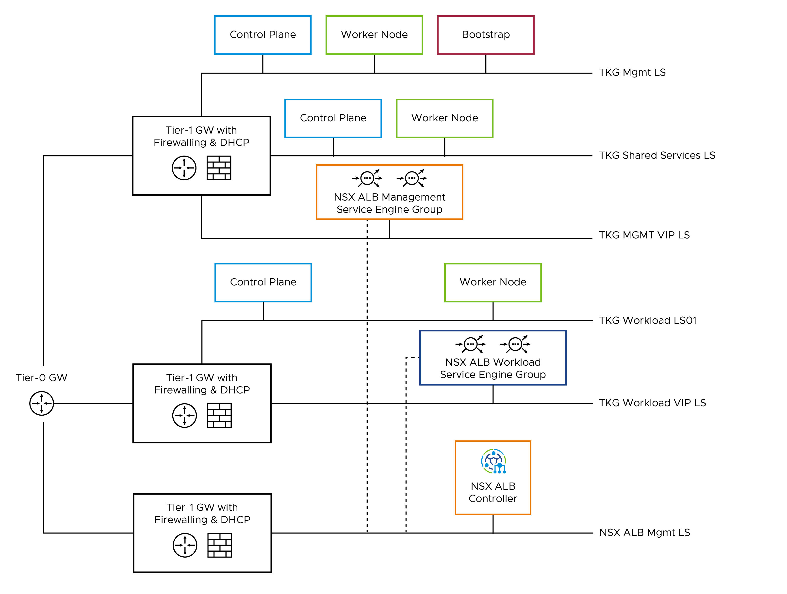

# TKGm

## Build the lab

1. Configure NSX T-0, T-1, and segments based on the the reference architecture using Terraform. Follow the instruction contained in [this](../terraform/stages/00-infra-vsphere-nsx/README.md) README.
1. Provision the vSphere resource using Terraform
  1. bootstrap machine (optional) Build a golden image using this [guide](../debian-golden-image/README.md).
  1. Resource group for ALB, tkgm
1. Configure a bootstrap machine
  1. (optional) Build a golden image using this [guide](../debian-golden-image/README.md).
  1. Deploy a VMs an install the necessary packages using [this](../ansible/tkgm-bootstrap) playbook.

1. Upload Kubernetes ova image and NSX Advance Load Balancer image to the content library
1. Deploy NSX ALB
1. Configure NSX Cloud, NSX service engines, replace certificate
