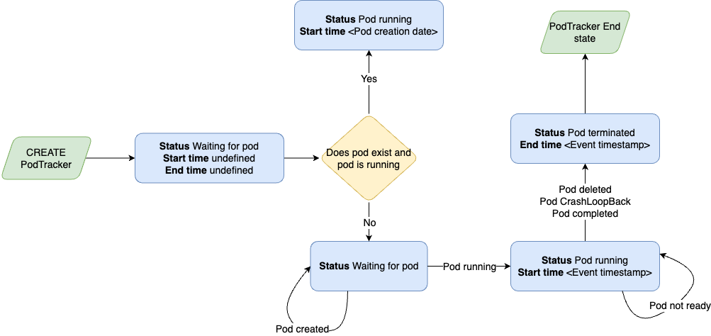

# pod-tracker

This is a toy controller that allows to track the execution of a pod using the PodTracker CRD. The PodTracker needs the name and the namespace of the pod to track and will report the execution time once the pod terminates.



## Getting Started

### Prerequisites

- go version v1.22.0+
- docker version 17.03+.
- kubectl version v1.11.3+.
- Access to a Kubernetes v1.11.3+ cluster.

### To Deploy on the cluster

**Build and push your image to the location specified by `IMG`:**

```sh
make docker-build docker-push IMG=<some-registry>/pod-tracker:tag
```

> You can chance the target platform in the Makefile

**Install the CRDs into the cluster:**

```sh
make install
```

**Deploy the Manager to the cluster with the image specified by `IMG`:**

```sh
make deploy IMG=<some-registry>/pod-tracker:tag
```

> **NOTE**: If you encounter RBAC errors, you may need to grant yourself cluster-admin
> privileges or be logged in as admin.

**Verify the status of the controller**

```sh
kubectl get pods -n pod-tracker-system
```

**Check the logs**

```sh
kubectl logs -n pod-tracker-system -f -l control-plane=controller-manager
```

**Create instances of your solution**
You can apply the samples (examples) from the config/sample:

```sh
kubectl apply -k config/samples/
```

### To Uninstall

**Delete the instances (CRs) from the cluster:**

```sh
kubectl delete -k config/samples/
```

**Delete the APIs(CRDs) from the cluster:**

```sh
make uninstall
```

**UnDeploy the controller from the cluster:**

```sh
make undeploy
```

### Local development

**Run the controller locally:**

```sh
make run
```

**Lint code:**

```sh
docker run --rm -v $(pwd):/app -w /app golangci/golangci-lint:v1.56.2 golangci-lint run -v
```

## Additional resources

- https://www.redhat.com/en/blog/creating-pod-watcher-operator-kubernetes
