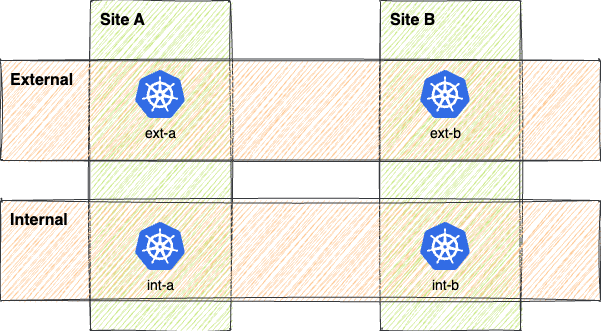

# Flux

This is an example on how to structure folders for using Flux in Tanzu Mission Control. This structure is based on the assumption that the clusters must be customized based on the environment (e.g. dev, staging, prod) but also on other factors, like a cluster type (e.g external, internal, site A, site B).



## Important note

Flux defined a CRD named Kustomization. Do not get confused with the resource Kustomization defined by Kustomize. They are two different resources and can be used together. The resources can be identified by the api group defined in the manifest.

## Folder structure

```bash
├── apps
└── clusters
    ├── base # contains the resources that must be deployed in all clusters
    └── overlays
        ├── external
        │   ├── site-a # Second layer of components for cluster in site A
        │   ├── site-b # Second layer of components for cluster in site B
        │   |── ...
        │   └── shared # Contains the components shared by all the cluster in the external group
        ├── internal
        └── ...
```

**Flux does not support multi-layer overlays** (an overlay that references another overlay). For this reason, each cluster can only have a single overlay as entry point. This file is represented by the `kustomization.yaml` file in the deepest level of the folder structure (e.g `clusters/overlays/external/site-a`), ideally there could be a specific folder for each cluster if the cluster contains specific customizations.

If we want to simulate the behavior of having multiple overlays we can use the `Component` resource. This give the ability to reference a base Kustomize and add on top different components.

All the configurations that must be applied to all clusters (e.g. Tanzu packages, operators, ...) can be placed in `clusters/base`. These resources must be explicitly referenced by the overlay in the cluster specific folder.

> The shared folders (e.g. `clusters/overlays/external/shared`) are required otherwise if you try to include the parent directory `clusters/overlays/external` in the Kustomization Kustomize will complain about a possible cycle.

The `apps` folder contains the definitions of applications (it can also be a reference to an external resource) that must be deployed in the clusters. Again, these resources must be explicitly referenced by the overlay or one of the components.

## Resources

The deployment of resources can be handled in at least 3 different ways:
* monorepo: include the Kubernetes manifests in the repo and reference them in `kustomization.yaml`
* Kustomization (`kustomize.toolkit.fluxcd.io`): Flux allows to reference resources that are hosted in external repositories
* Helm release : Flux allows to reference Helm charts that are hosted in external repositories

||Pros|Cons|
|-|-|-|
|Monorepo|Patches can be "easily" written<br>The full changes can be viewed with `kubectl diff`||
|Flux Kustomization|It can be used to decouple the repository used for managing the cluster from the repositories containing the manifests of specific resources (e.g. apps)</br>The reconciliation state of each component can be inspected with `kubectl`|Write patches is difficult because Kustomize patches will not work as it is. The patch must be included in the Kustomization, hence if the Flux Kustomization is the base layer a Kustomization `kustomize.config.k8s.io` patch that include a Kustomization `kustomize.toolkit.fluxcd.io` path must be written (nested patches)|
|Helm release|It can be used to decouple the repository used for managing the cluster from the repositories containing the manifests of specific resources (e.g. apps)</br>The reconciliation state of each component can be inspected with `kubectl`|If the Helm chart is well written, it can be easily patched using the values property of the CRD.|

## Limitations

* `namePrefix` does not work very well with Kustomization (`kustomize.toolkit.fluxcd.io`) `dependsOn` attribute. Since the name of the resource will be prefixed, during the reconciliation the cluster is not able to find the dependency.

## Cheat sheet

###### Preview manifests applied by Kustomize

```bash
kustomize build <path-to-folder-containing-kustomization.yaml>
```

###### Generate diff with online configuration

```bash
export KUBECTL_EXTERNAL_DIFF="colordiff -N -u"
kubectl diff --prune -k <path-to-folder-containing-kustomization.yaml>
```
