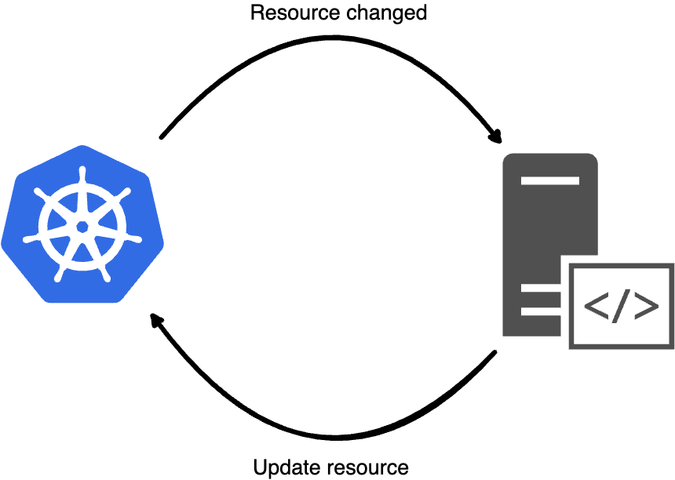

# operator-sdk
How to build a Kubernetes operator from scratch

---
transition: fade-out
---

# Agenda

- What is a Kubernetes operator
- What is operator-sdk
- Build a simple operator
- Deploy the operator

---
transition: fade-out
---

# What is a Kubernetes operator ?

Operators are software extensions to Kubernetes that make use of custom resources to manage applications and their components.



<style>
.center {
  display: block;
  margin-left: auto;
  margin-right: auto;
  margin-top: 30px;
}
</style>

---

# What is operator-sdk ?
<br><br>
<i>"operator-sdk is a component of the Operator Framework, an open source toolkit to manage Kubernetes native applications, called Operators, in an effective, automated, and scalable way."</i>

---
transition: fade-out
---

# Build a simple operator (define types)

````md magic-move
```go
type PodTracker struct {
    metav1.TypeMeta
    metav1.ObjectMeta

    Spec   PodTrackerSpec
    Status PodTrackerStatus
}
```

```go {*|5-6}
type PodTracker struct {
    metav1.TypeMeta   `json:",inline"`
    metav1.ObjectMeta `json:"metadata,omitempty"`

    Spec   PodTrackerSpec   `json:"spec,omitempty"`
    Status PodTrackerStatus `json:"status,omitempty"`
}
```

```go {*|4-5}
type PodTracker struct {
    // ...

    Spec   PodTrackerSpec   `json:"spec,omitempty"`
    Status PodTrackerStatus `json:"status,omitempty"`
}
```

```go {4-5,8-16}
type PodTracker struct {
    // ...

    Spec   PodTrackerSpec   `json:"spec,omitempty"`
    Status PodTrackerStatus `json:"status,omitempty"`
}

type PodTrackerSpec struct {
    PodToTrack PodToTrack `json:"podToTrack"`
}

type PodToTrack struct {
    Name      string `json:"name"`
    Namespace string `json:"namespace"`
}
```

```go {4-5,8-21}
type PodTracker struct {
    // ...

    Spec   PodTrackerSpec   `json:"spec,omitempty"`
    Status PodTrackerStatus `json:"status,omitempty"`
}

type PodTrackerStatus struct {
    PodStatus     PodStatus       `json:"podStatus"`
    StartTime     metav1.Time     `json:"startTime,omitempty"`
    EndTime       metav1.Time     `json:"endTime,omitempty"`
    ExecutionTime metav1.Duration `json:"executionTime,omitempty"`
}

type PodStatus string

const (
    WaitingForPod PodStatus = "WaitingForPod"
    PodReady      PodStatus = "PodReady"
    PodTerminated PodStatus = "PodTerminated"
)
```
````

---
---

# Build a simple operator (setup the operator)

````md magic-move
```go
func main() {
  mgr := ctrl.NewManager(...)
}
```

```go {5-8}
func main() {

  mgr := ctrl.NewManager(...)

  reconciler := &controller.PodTrackerReconciler{
		Client: mgr.GetClient(),
		Scheme: mgr.GetScheme(),
	}
}
```

```go {10}
func main() {

  mgr := ctrl.NewManager(...)

  reconciler := &controller.PodTrackerReconciler{
		Client: mgr.GetClient(),
		Scheme: mgr.GetScheme(),
	}

  reconciler.SetupWithManager(mgr);
}
```

```go {10,13-18}
func main() {

  mgr := ctrl.NewManager(...)

  reconciler := &controller.PodTrackerReconciler{
		Client: mgr.GetClient(),
		Scheme: mgr.GetScheme(),
	}

  reconciler.SetupWithManager(mgr);
}

func (r *PodTrackerReconciler) SetupWithManager(mgr ctrl.Manager) error {

	return ctrl.NewControllerManagedBy(mgr).
		For(&podsv1alpha1.PodTracker{}).
		Complete(r)
}
```

```go {19-22}
func main() {

  mgr := ctrl.NewManager(...)

  reconciler := &controller.PodTrackerReconciler{
		Client: mgr.GetClient(),
		Scheme: mgr.GetScheme(),
	}

  reconciler.SetupWithManager(mgr);
}

func (r *PodTrackerReconciler) SetupWithManager(mgr ctrl.Manager) error {

	// Instruct the controller to trigger the reconcile loop for objects of type PodTracker and to 
	// to watch updates for objects of type Pods.
	return ctrl.NewControllerManagedBy(mgr).
		For(&podsv1alpha1.PodTracker{}).
		Watches(
			&corev1.Pod{},
			handler.EnqueueRequestsFromMapFunc(r.findTrackersForPod),
		).
		Complete(r)
}
```
````

---
level: 2
---

# Build a simple operator (reconcile loop)

````md magic-move
```go {1,6|2-5}
func (r *PodTrackerReconciler) Reconcile(ctx context.Context, req ctrl.Request) (ctrl.Result, error) {
  logger := log.FromContext(ctx)
  logger.Info("Request for", "resource", req.NamespacedName)

  return ctrl.Result{}, nil
}
```

```go {1,6}
// +kubebuilder:rbac:groups=pods.giovannibaratta.local,resources=podtrackers,verbs=get;list;watch;create;update;patch;delete
func (r *PodTrackerReconciler) Reconcile(ctx context.Context, req ctrl.Request) (ctrl.Result, error) {
  logger := log.FromContext(ctx)
  logger.Info("Request for", "resource", req.NamespacedName)

  return ctrl.Result{}, nil
}
```

```go {6-7}
// +kubebuilder:rbac:groups=pods.giovannibaratta.local,resources=podtrackers,verbs=get;list;watch;create;update;patch;delete
func (r *PodTrackerReconciler) Reconcile(ctx context.Context, req ctrl.Request) (ctrl.Result, error) {
  logger := log.FromContext(ctx)
  logger.Info("Request for", "resource", req.NamespacedName)

  podTracker := &podsv1alpha1.PodTracker{}
  r.Get(ctx, req.NamespacedName, podTracker)

  return ctrl.Result{}, nil
}
```

```go {10-12}
// +kubebuilder:rbac:groups=pods.giovannibaratta.local,resources=podtrackers,verbs=get;list;watch;create;update;patch;delete
func (r *PodTrackerReconciler) Reconcile(ctx context.Context, req ctrl.Request) (ctrl.Result, error) {
  logger := log.FromContext(ctx)
  logger.Info("Request for", "resource", req.NamespacedName)

  // Add your logic here
  podTracker := &podsv1alpha1.PodTracker{}
  r.Get(ctx, req.NamespacedName, podTracker)

  podTracker.Status = podsv1alpha1.PodTrackerStatus{
      PodStatus: podsv1alpha1.WaitingForPod,
  }
  r.Status().Update(ctx, podTracker)

  return ctrl.Result{}, nil
}
```
````

---

# Deploy the operator

<br>
Generate the manifest (CRDs, bindings, ...)
```sh
make manifests
```

<br>

<div v-click>
Build the image
```sh
manifest docker-build docker-push IMG="repository/podtracker-operator:v1"
```
<br>
</div>

<div v-click>
Deploy the operator
```sh
manifest deploy IMG="repository/podtracker-operator:v1"
```
</div>

---

# Deploy the operator (output)
<br>
```sh
➜ kubectl api-resources --api-group=pods.giovannibaratta.local         
NAME          SHORTNAMES   APIVERSION                            NAMESPACED   KIND
podtrackers                pods.giovannibaratta.local/v1alpha1   true         PodTracker
```
<br>

<div v-click>
```sh
➜ kubectl get pods -n pod-tracker-system
NAME                                              READY   STATUS    RESTARTS      AGE
pod-tracker-controller-manager-7d65fcf5fb-76zs4   2/2     Running   2 (10m ago)   5d4h
```
<br>
</div>

<div v-click>
```sh
➜ kubectl get podtrackers -n default                      
NAME                TRACKED NAMESPACE   TRACKED POD    STATE
podtracker-sample   target-namespace    pod-to-track   PodReady
test-resource       target-namespace    pod-to-track   PodReady
tracker2            target-namespace    pod-to-track   PodTerminated
tracker3            target-namespace    another-pod    WaitingForPod
```
</div>

---

# Deploy the operator (output)

````md magic-move
```sh {*|7|13-16|17-20}
➜ kubectl describe podtracker -n default     test-resource
Name:         test-resource
Namespace:    default
Labels:       <none>
Annotations:  <none>
API Version:  pods.giovannibaratta.local/v1alpha1
Kind:         PodTracker
Metadata:
  Creation Timestamp:  2024-03-08T12:09:25Z
  Generation:          1
  Resource Version:    96763
  UID:                 465712d1-394b-4437-8119-d95d0deed112
Spec:
  Pod To Track:
    Name:       pod-to-track
    Namespace:  target-namespace
Status:
  Execution Time:  0s
  Pod Status:      PodReady
  Start Time:      2024-03-08T12:18:27Z
Events:            <none>
```
````